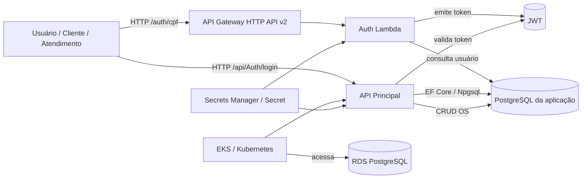
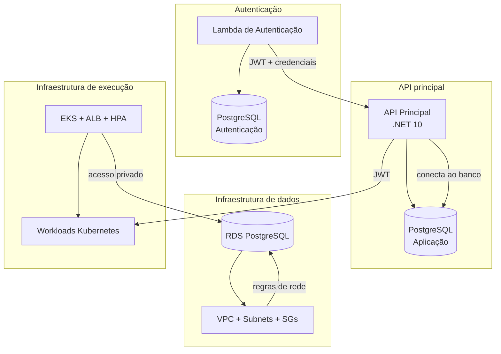
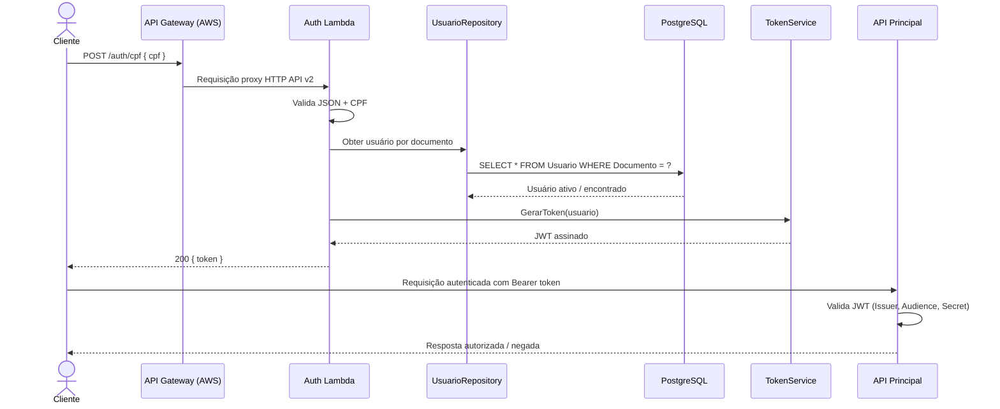
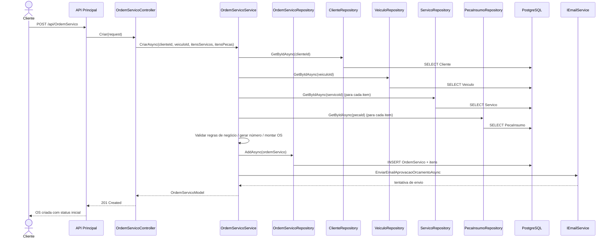
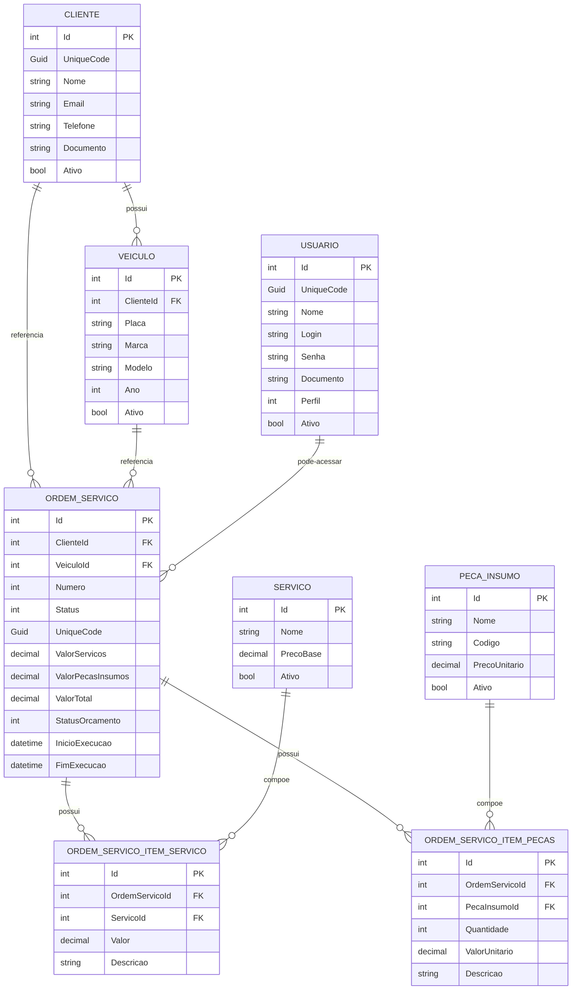
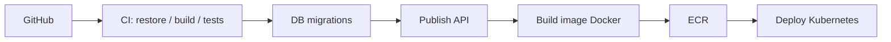

# Documentação Arquitetural da Solução Tech Challenge

## 1. Visão Geral

Este documento apresenta a arquitetura da solução Tech Challenge, com foco na gestão de oficina mecânica, incluindo autenticação, cadastro de clientes e veículos, catalogação de serviços e peças, controle de ordens de serviço e aprovação de orçamento.

### 1.1 Objetivo da solução

A solução foi concebida para apoiar os processos operacionais de uma oficina mecânica, com suporte a:

- cadastro e manutenção de clientes;
- cadastro e controle de veículos;
- catalogação de serviços e peças/insumos;
- abertura, acompanhamento e finalização de ordens de serviço;
- autenticação e autorização de usuários;
- aprovação ou reprovação de orçamento.

### 1.2 Contexto da arquitetura

A solução foi estruturada em camadas para separar responsabilidades de apresentação, aplicação, domínio e infraestrutura. A API principal concentra a lógica de negócio e a orquestração das operações, enquanto a autenticação e a infraestrutura de execução e persistência complementam o ambiente operacional.

### 1.3 Arquitetura geral da solução

A arquitetura implementada contempla:

- API principal em .NET 10, com controllers, serviços, autenticação JWT e acesso a dados via Entity Framework Core;
- banco relacional PostgreSQL para persistência do domínio;
- autenticação independente por JWT em ambiente AWS Lambda, com integração via API Gateway;
- infraestrutura de execução em Kubernetes/EKS;
- infraestrutura de dados em Amazon RDS PostgreSQL;
- uso de segurança, IAM, Secrets Manager e grupos de segurança para controle de rede e acesso.

### 1.4 Principais componentes

- API REST principal: `tech_challenge.API`
- Camada de aplicação: `tech_challenge.Application`
- Núcleo de negócio: `tech_challenge.Domain`
- Persistência e infraestrutura: `tech_challenge.Infrastructure`
- Banco de dados: PostgreSQL 16
- Autenticação: JWT + Lambda + API Gateway
- Infraestrutura de execução: Kubernetes/EKS
- Infraestrutura de dados: RDS PostgreSQL + VPC + Security Groups + Secrets Manager

---

## 2. Estrutura dos Módulos da Solução

| Módulo | Responsabilidade | Tecnologia principal | Papel na arquitetura |
|---|---|---|---|
| API principal | Gestão do domínio e serviços da oficina | .NET 10, ASP.NET Core, EF Core, JWT | Núcleo funcional da solução |
| Autenticação | Emissão e validação de tokens para acesso | JWT, Lambda, API Gateway | Segurança e autorização |
| Persistência | Armazenamento de clientes, serviços, peças e ordens | PostgreSQL, Npgsql | Camada de dados |
| Infraestrutura de execução | Rodar a aplicação em ambiente escalável | Kubernetes, EKS, HPA, ALB | Runtime e disponibilidade |
| Infraestrutura de dados | Provisionamento do banco e da rede | Terraform, AWS RDS, VPC, SG | Suporte de produção e governança |

---

## 3. Arquitetura da Solução

### 3.1 Visão funcional

O fluxo principal do negócio é:

1. cliente ou atendente acessa a API principal;
2. a API valida autenticação por JWT;
3. o usuário realiza operações de cadastro, consulta, atualização e acompanhamento de ordens de serviço;
4. a API persiste as informações em PostgreSQL;
5. o orçamento pode ser aprovado ou reprovado por endpoint específico;
6. o sistema realiza tentativa de envio de e-mail de aprovação da ordem de orçamento por meio do serviço de e-mail.

### 3.2 Visão de infraestrutura

A infraestrutura implementada contempla:

- banco em RDS PostgreSQL;
- runtime da API em EKS/Kubernetes;
- escalonamento horizontal via HPA;
- autenticação separada em Lambda AWS;
- rede com VPC, subnets privadas, security groups e endpoint privado de Secrets Manager;
- Load Balancer Controller e Ingress para acesso via ALB.

### 3.3 Segurança

- uso de JWT com validação de emissor, audiência, expiração e chave de assinatura;
- autorização por roles em controllers e endpoints da API;
- armazenamento de senhas em formato hash com BCrypt;
- uso de Security Groups e políticas de rede para restringir acesso ao banco;
- uso de Secrets Manager para armazenamento de credenciais e segredos sensíveis.

### 3.4 Observabilidade e operação

A solução conta com mecanismos básicos de observabilidade e operação, como:

- health checks em `/health` na API principal;
- readiness/liveness probes no deployment Kubernetes;
- logs de banco em CloudWatch para o RDS PostgreSQL;
- HPA com métricas de CPU e memória;
- monitoramento de infraestrutura e disponibilidade por serviços da plataforma de cloud.

---

## 4. Diagrama de Componentes



---

## 5. Componentes da Solução

### 5.1 API principal

A API principal é o núcleo funcional da solução e concentra a gestão do domínio da oficina. Ela disponibiliza endpoints para autenticação, clientes, veículos, serviços, peças e ordens de serviço, além de regras de negócio para cálculo de valores, status e aprovação do orçamento.

### 5.2 Camada de aplicação

A camada de aplicação organiza os serviços que coordenam a lógica de processo, como criação de ordem de serviço, validação de referências entre cliente/veículo/serviço/peças e envio de e-mail de aprovação. Essa camada atua como mediadora entre a interface externa e o domínio, preservando as regras de negócio no núcleo da aplicação.

### 5.3 Camada de domínio

O domínio inclui entidades e regras fundamentais do sistema, como cliente, veículo, usuário, serviço, peça/insumo, ordem de serviço, itens da ordem e ciclo de status da operação. O uso de entidades e agregados permite centralizar a lógica de negócio e reduzir o acoplamento com a infraestrutura de persistência.

### 5.4 Autenticação e autorização

A solução implementa autenticação baseada em JWT e autorização por perfil/role. O acesso aos endpoints é controlado por regras de usuário, permitindo distinção entre perfis como atendimento, cliente e mecânico.

### 5.5 Infraestrutura de execução e persistência

A infraestrutura suporta a execução em ambiente cloud e escalável, com uso de Kubernetes/EKS para orquestração dos serviços, HPA para elasticidade e PostgreSQL como base relacional. A persistência e a infraestrutura são reforçadas por controles de rede, IAM e Secrets Manager, garantindo segurança e isolamento do ambiente de produção.

---

## 6. Integração entre os Módulos



> A solução é composta por módulos especializados, com integração por autenticação, rede e persistência. A API principal e o serviço de autenticação operam de forma complementar, mantendo separação funcional e reforçando segurança e isolamento de responsabilidades.

---

## 7. Diagrama de Sequência — Autenticação



### Comentário sobre o fluxo

Existem dois fluxos de autenticação na solução:

1. fluxo principal da API, com login e geração de JWT no próprio backend da aplicação;
2. fluxo complementar em Lambda, com geração de token por documento e autenticação em ambiente AWS.

A arquitetura considera ambos os fluxos como válidos e distintos, porém funcionalmente convergentes para a autorização dos usuários.

---

## 8. Diagrama de Sequência — Abertura de Ordem de Serviço



### Observação sobre aprovação de orçamento

Além do fluxo principal de criação, a solução contempla endpoint de aprovação do orçamento por querystring, permitindo aprovação ou reprovação com base em código único da ordem e status informado. Esse mecanismo complementa o ciclo do orçamento e a comunicação com o usuário final.

---

## 9. Banco de Dados

### 9.1 Estrutura da aplicação principal

A aplicação principal usa `AppDbContext` para mapear entidades em PostgreSQL. As entidades principais são:

- `Cliente`
- `Veiculo`
- `Usuario`
- `Servico`
- `PecaInsumo`
- `OrdemServico`
- `OrdemServicoItemServico`
- `OrdemServicoItemPecaInsumo`

#### DbContext

O `AppDbContext` contém as seguintes coleções:

- `DbSet<Cliente> Clientes`
- `DbSet<Veiculo> Veiculos`
- `DbSet<Usuario> Usuarios`
- `DbSet<Servico> Servicos`
- `DbSet<PecaInsumo> PecasInsumos`
- `DbSet<OrdemServico> OrdemServicos`
- `DbSet<OrdemServicoItemServico> OrdemServicoItemServicos`
- `DbSet<OrdemServicoItemPecaInsumo> OrdemServicoItemPecaInsumos`

#### Migrations

O projeto inclui migrations que representam a evolução do modelo relacional, incluindo:

- `PrimeiraMigracao`
- `CriadoCamposCodigoEAjusteOrdemServico`
- `CriarDocumentoUsuario`

### 9.2 Infraestrutura do banco

A infraestrutura do banco utiliza PostgreSQL em ambiente AWS RDS com:

- `aws_db_instance`
- `aws_db_parameter_group`
- `aws_db_subnet_group`
- `aws_security_group`
- `aws_vpc_endpoint`
- `aws_cloudwatch_log_group`

#### Segurança da conexão

- `publicly_accessible = false`
- `rds.force_ssl = 1`
- `vpc_security_group_ids` restringem o acesso ao banco
- a infraestrutura não expõe o banco publicamente

### 9.3 Como a aplicação acessa o banco

No projeto principal, a conexão é configurada pelo `ConnectionStrings:DefaultConnection` e registrada em `InfrastructureServiceRegistration`:

```csharp
services.AddDbContext<AppDbContext>(options =>
    options.UseNpgsql(config.GetConnectionString("DefaultConnection")));
```

A configuração local utiliza host local do PostgreSQL, enquanto o ambiente de execução em Kubernetes utiliza connection string apontando para a infraestrutura de produção.

### 9.4 Por que PostgreSQL

A decisão por PostgreSQL é coerente com a solução por vários motivos:

- suporte nativo ao EF Core via `UseNpgsql`;
- suporte a relacionamentos complexos entre clientes, veículos, serviços e ordens;
- compatibilidade com o ambiente RDS da AWS;
- arquitetura orientada a dados transacionais e consultas CRUD robustas.

---

## 10. Diagrama ER



---

## 11. Infraestrutura AWS

### 11.1 Serviços de plataforma

| Serviço | Função | Status |
|---|---|---|
| AWS Lambda | execução da função de autenticação | ✅ Implementado |
| API Gateway HTTP API v2 | exposição do endpoint de autenticação | ✅ Implementado |
| EKS | runtime da solução em Kubernetes | ✅ Implementado |
| RDS PostgreSQL | banco relacional da aplicação | ✅ Implementado |
| VPC | isolamento e segmentação da infraestrutura | ✅ Implementado |
| Security Groups | controle de acesso ao banco e serviços | ✅ Implementado |
| Secrets Manager | armazenamento de credenciais e segredos | ✅ Implementado |
| IAM | permissões de cluster, nodes e leitura de segredos | ✅ Implementado |
| ALB / Load Balancer | balanceamento de tráfego para workloads | ✅ Implementado |
| CloudWatch Logs | logs e monitoramento do banco | ✅ Implementado |
| ECR | publicação de imagens da aplicação | ✅ Implementado |

### 11.2 Papel de cada componente

- API Gateway expõe a autenticação em ambiente AWS.
- Lambda consulta usuário em PostgreSQL e gera JWT.
- EKS hospeda a API principal em pods.
- RDS mantém o banco relacional da aplicação.
- Security Groups filtram a comunicação entre serviços e banco.
- Secrets Manager guarda segredos e credenciais sensíveis.

---

## 12. Kubernetes / EKS

A infraestrutura de execução foi desenhada para suportar disponibilidade, escalabilidade e roteamento de tráfego para a aplicação principal.

### 12.1 Manifestos da aplicação

Os manifestos incluem:

- `namespace.yaml` — namespace da aplicação
- `configmap.yaml` — variáveis globais para configuração
- `secret.yaml` — segredos de conexão e JWT
- `api-deployment.yaml` — deployment da API
- `api-service.yaml` — serviço de acesso à API
- `hpa.yaml` — escalonamento horizontal de pods

### 12.2 Configurações de saúde e escalabilidade

A API principal utiliza:

- readiness probe em `/health`
- liveness probe em `/health`
- `maxReplicas: 5`
- `minReplicas: 2`
- target de CPU e memória para escalonamento automático

### 12.3 Infraestrutura de Kubernetes na plataforma

A infraestrutura de execução contempla:

- VPC com subnets públicas e privadas;
- managed node groups;
- IAM para cluster e nodes;
- Load Balancer Controller via Helm;
- Ingress com ALB;
- HPA em workloads da aplicação;
- namespace dedicado para execução e observabilidade.

### 12.4 Diagrama Kubernetes

```mermaid
flowchart LR
    Internet --> ALB[Application Load Balancer]
    ALB --> Ingress[Ingress / ALB Controller]
    Ingress --> SVC[Service ClusterIP / LoadBalancer]
    SVC --> API[Deployment api\n2 replicas]
    API --> Health[/health]
    API --> DB[(RDS PostgreSQL)]
    API --> HPA[HorizontalPodAutoscaler]
    HPA --> API
```

---

## 13. Terraform / Infrastructure as Code

### 13.1 Infraestrutura de banco

Os principais recursos provisionados são:

- `aws_vpc`
- `aws_subnet`
- `aws_db_subnet_group`
- `aws_db_instance`
- `aws_db_parameter_group`
- `aws_security_group`
- `aws_vpc_security_group_ingress_rule`
- `aws_vpc_security_group_egress_rule`
- `aws_vpc_endpoint`
- `aws_iam_policy`
- `aws_cloudwatch_log_group`

### 13.2 Infraestrutura de execução

Os recursos provisionados são:

- `aws_eks_cluster`
- `aws_eks_node_group`
- `aws_iam_role`
- `aws_security_group`
- `aws_iam_policy`
- `helm_release` para controller e metrics server
- recursos Kubernetes em `platform/`

### 13.3 Aplicação e infraestrutura

A aplicação principal utiliza manifestos Kubernetes e Docker Compose para execução local e de produção, enquanto a infraestrutura em cloud é tratada por provisionamento automatizado em Terraform.

---

## 14. Segurança

### 14.1 JWT e autorização

Na API principal:

- validação do token com `ValidateIssuer`, `ValidateAudience`, `ValidateLifetime` e `ValidateIssuerSigningKey`;
- geração de JWT com issuer, audience e secret;
- uso de `Authorize(Roles = ...)` em endpoints sensíveis.

Na autenticação Lambda:

- geração de JWT com `JWT_SECRET`, `JWT_ISSUER`, `JWT_AUDIENCE`;
- token assinado com HMAC SHA256.

### 14.2 Senhas

- usuários da API armazenam senha em hash com BCrypt;
- validação de login usa `BCrypt.Verify`;
- autenticação por CPF em fluxo separado utiliza documento como critério principal.

### 14.3 Rede e IAM

- banco PostgreSQL é privado, com `publicly_accessible = false`;
- grupos de segurança permitem acesso ao banco apenas para serviços autorizados;
- endpoint privado de Secrets Manager limita a exposição de segredos;
- políticas IAM restringem acesso a recursos críticos.

### 14.4 Fronteira de confiança

A fronteira de confiança da solução é a seguinte:

- Internet → API Gateway → Lambda de autenticação (AWS)
- Internet / cliente → Ingress/ALB → API principal em Kubernetes
- Dentro da VPC privada → EKS / Lambda → RDS PostgreSQL
- segredos e credenciais protegidos em Secrets Manager

---

## 15. Observabilidade

### Implementado

- `app.MapHealthChecks("/health")` na API principal;
- readiness e liveness probes no Kubernetes;
- logs do PostgreSQL em CloudWatch;
- HPA com métricas de CPU e memória.

### Implementação complementar

- envio de e-mail de aprovação por serviço de e-mail;
- infraestrutura de observabilidade em namespace específico da plataforma;
- monitoramento de infraestrutura e logs de ambiente cloud.

### Não identificado como foco central

- tracing distribuído completo;
- plataforma completa de métricas e alertas;
- mensageria e filas para processamento assíncrono de eventos.

---

## 16. Escalabilidade

### 16.1 Escalonamento da API principal

- deployment com múltiplas réplicas;
- HPA com minReplicas e maxReplicas;
- métricas de CPU e memória para ajustes automáticos;
- probes de readiness/liveness para reinicialização segura.

### 16.2 Escalonamento em infraestrutura

- EKS com node groups gerenciados;
- ALB/Ingress para distribuição de tráfego;
- escalabilidade horizontal tanto de pods quanto de capacidade de infraestrutura.

### 16.3 Banco

- RDS com capacidade de expansão configurável;
- suporte a logs, backup e alta disponibilidade
- utilização de PostgreSQL em ambiente cloud para garantir suporte transacional e confiabilidade.

---

## 17. CI/CD

A solução contempla pipeline de integração e entrega contínua, com etapas de build, testes, publicação de artefatos e deploy em ambiente de execução.



### 17.1 Pipeline principal

A aplicação segue fluxo de:

- restauração de dependências;
- compilação e testes;
- geração de artefatos;
- construção da imagem Docker;
- publicação no registro de imagens;
- deploy em ambiente Kubernetes.

### 17.2 Infraestrutura

Os repositórios de infraestrutura também adotam automação para validação, planejamento e provisionamento dos recursos de cloud.

---

## 18. RFCs

### RFC-001 — Escolha da AWS
- Contexto: necessidade de infraestrutura cloud com EKS, RDS, Lambda, Secrets Manager e IAM.
- Decisão: utilizar a AWS como principal plataforma de execução e dados.

### RFC-002 — Escolha do PostgreSQL
- Contexto: necessidade de persistência relacional com suporte ao Entity Framework Core.
- Decisão: usar PostgreSQL 16 com provisionamento em RDS e execução local em container.

### RFC-003 — Estratégia de autenticação
- Contexto: necessidade de autenticação segura e autorização por perfil.
- Decisão: adotar JWT em API principal e fluxo complementar em Lambda para autenticação em ambiente cloud.

### RFC-004 — API Gateway
- Contexto: entrada HTTPS para autenticação em serviço serverless.
- Decisão: usar API Gateway HTTP API v2 para roteamento e exposição do endpoint.

### RFC-005 — Kubernetes/EKS
- Contexto: necessidade de runtime escalável e padronizado.
- Decisão: provisionar cluster EKS com HPA, ALB e orquestração de workloads.

### RFC-006 — Infrastructure as Code
- Contexto: necessidade de provisionamento reprodutível e versionado.
- Decisão: usar Terraform para VPC, EKS, RDS, IAM, grupos de segurança e endpoints.

### RFC-007 — Estratégia de comunicação
- Contexto: necessidade de comunicação segura entre módulos e infraestrutura.
- Decisão: combinar comunicação via REST, banco relacional e infraestrutura privada por VPC e security groups.

---

## 19. ADRs

### ADR-001 — Arquitetura Hexagonal
- Status: Aceito
- Contexto: necessidade de manter regras de negócio desacopladas da tecnologia.
- Decisão: separar domínio, aplicação e infraestrutura.

### ADR-002 — DDD
- Status: Aceito
- Contexto: regras complexas de negócios em ordens de serviço e manutenção.
- Decisão: organizar entidades e comportamentos dentro do domínio.

### ADR-003 — JWT
- Status: Aceito
- Contexto: autenticação e autorização da API.
- Decisão: utilizar JWT com claims e validação assíncrona por secret e políticas de segurança.

### ADR-004 — Lambda para autenticação
- Status: Aceito
- Contexto: necessidade de um fluxo de autenticação especialista e independente.
- Decisão: implementar autenticação em serviço serverless com Lambda.

### ADR-005 — Kubernetes/EKS
- Status: Aceito
- Contexto: necessidade de ambiente escalável para a aplicação.
- Decisão: utilizar EKS com orquestração e gerenciamento automático de capacidade.

### ADR-006 — PostgreSQL/RDS
- Status: Aceito
- Contexto: persistência transacional e suporte ao modelo relacional.
- Decisão: utilizar PostgreSQL em ambiente de produção via RDS.

### ADR-007 — Terraform
- Status: Aceito
- Contexto: provisionamento de infraestrutura em múltiplos ambientes.
- Decisão: manter infraestrutura como código por meio de Terraform.

---

## 20. Status de Implementação

| Componente | Status | Observação |
|---|---|---|
| API principal | ✅ Implementado | núcleo funcional da solução |
| JWT na API principal | ✅ Implementado | autenticação e autorização |
| Lambda de autenticação | ✅ Implementado | fluxo complementar em ambiente AWS |
| API Gateway | ✅ Implementado | exposição do endpoint de autenticação |
| PostgreSQL da aplicação | ✅ Implementado | persistência do domínio |
| RDS PostgreSQL | ✅ Implementado | infraestrutura de dados em produção |
| EKS | ✅ Implementado | infraestrutura de execução |
| HPA | ✅ Implementado | escalonamento automático |
| Terraform | ✅ Implementado | provisionamento de infraestrutura |
| Docker | ✅ Implementado | containerização da aplicação |
| Observabilidade básica | ✅ Implementado | health checks e logs |
| OpenTelemetry / tracing distribuído | ⚠️ Parcialmente implementado | não configurado como núcleo da solução |
| Mensageria assíncrona | ⚠️ Não centralizado | não é requisito principal da arquitetura atual |

---

## 21. Considerações Finais

A arquitetura implementada representa uma solução distribuída e modular, com forte separação entre domínio, aplicação, autenticação e infraestrutura. A API principal centraliza a lógica do negócio, o banco de dados garante persistência relacional, a autenticação reforça segurança por meio de JWT e serverless, e a infraestrutura em Kubernetes e AWS oferece escalabilidade, confiabilidade e governança operacional.

Essa combinação de tecnologias e padrões resulta em uma solução adequada ao contexto de uma oficina mecânica digital, com foco em produtividade, rastreabilidade das ordens de serviço e controle seguro do acesso aos processos.

---

## 22. Resumo Final da Arquitetura

A solução é composta por:

1. API principal em .NET 10, com autenticação e autorização por JWT.
2. PostgreSQL como banco relacional principal da aplicação.
3. fluxo complementar de autenticação em Lambda e API Gateway.
4. infraestrutura de execução em Kubernetes/EKS com HPA e ALB.
5. banco em RDS PostgreSQL em ambiente cloud, protegido por VPC, Security Groups e Secrets Manager.
6. provisionamento automatizado por Terraform.
7. pipeline de CI/CD com build, testes, containerização e deploy.

Essa arquitetura oferece um ambiente robusto para o domínio de oficina mecânica, com separação clara de responsabilidades, segurança de acesso e capacidade de crescimento operacional.
