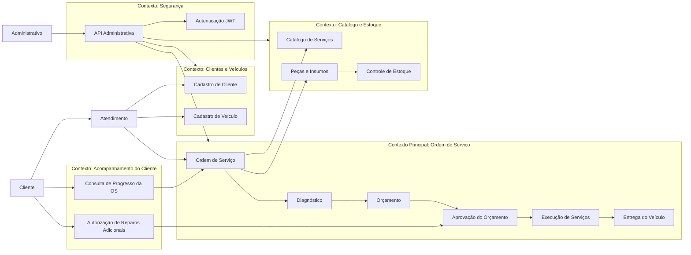
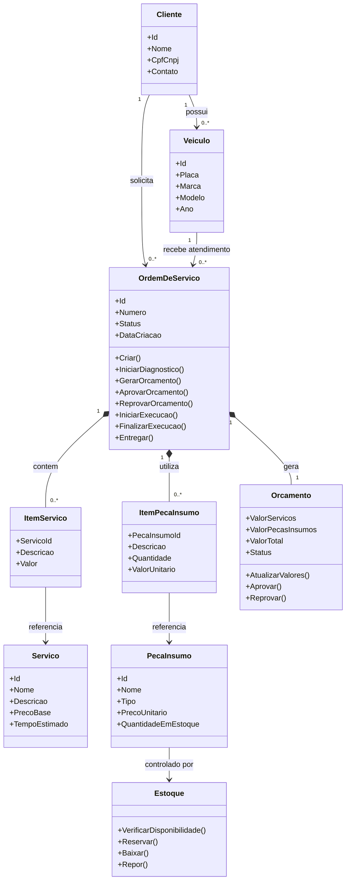
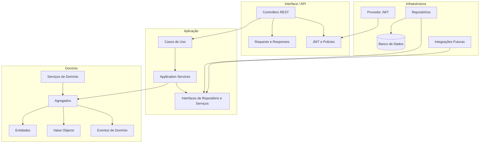
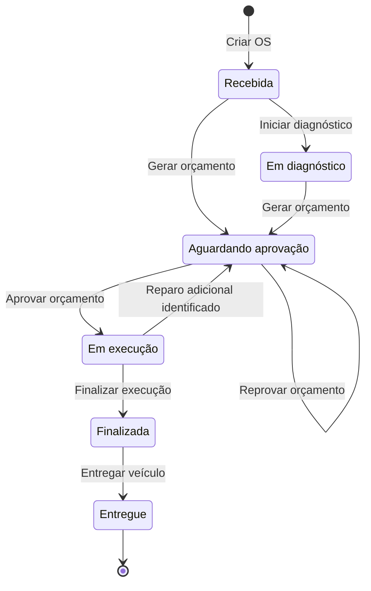
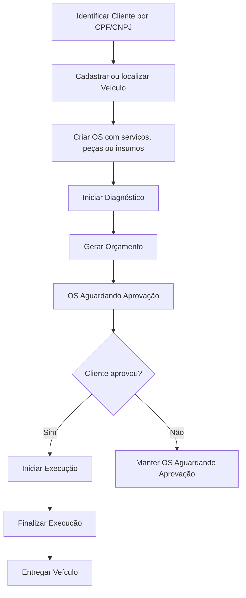
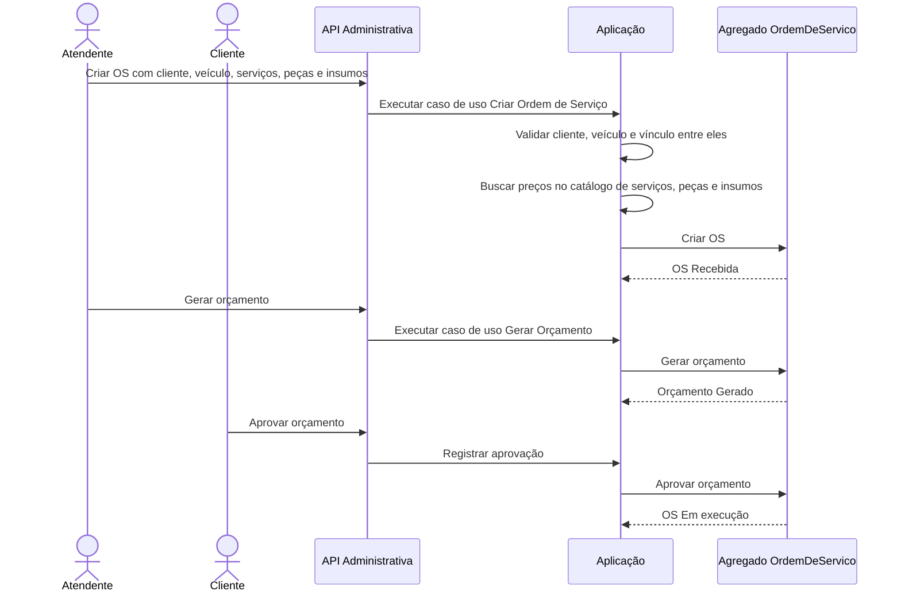
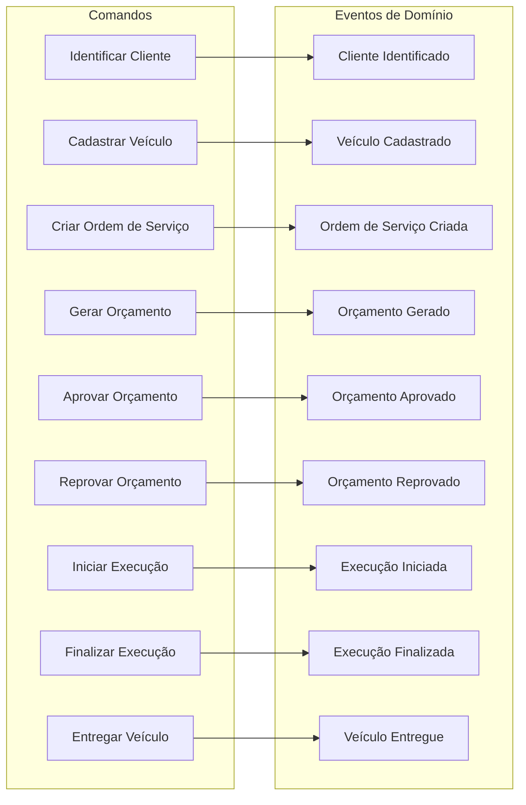

# Diagramas DDD

Este documento apresenta uma visão inicial dos diagramas de Domain-Driven Design (DDD) para o MVP do Sistema Integrado de Atendimento e Execução de Serviços da Oficina.

Os nomes usados aqui seguem a linguagem ubíqua definida em [`linguagem-ubiqua-template.md`](./linguagem-ubiqua-template.md).

## Context Map

O contexto principal do MVP é a gestão da Ordem de Serviço (OS). Os demais contextos apoiam esse fluxo com dados cadastrais, catálogo, estoque, autenticação e acompanhamento do cliente.

## Modelo de Domínio

Neste MVP, `OrdemDeServico` é o principal agregado. Ela referencia cliente, veículo, serviços, peças, insumos, orçamento e controla o status da OS.

## Camadas DDD

A API deve orquestrar casos de uso por meio da camada de aplicação. As regras de negócio ficam no domínio, e detalhes técnicos permanecem na infraestrutura.

## Ciclo de Vida da Ordem de Serviço

Os status oficiais da OS devem ser usados exatamente como definidos na linguagem ubíqua.

## Fluxo Principal da OS

Este fluxo representa a jornada principal desde a identificação do cliente até a entrega do veículo.

## Fluxo Implementado na API

O fluxo disponível na API administrativa usa a rota base `api/OrdemServico` e exige autenticação JWT com perfil de `Atendimento`, seguindo o mesmo padrão dos demais controllers.

| Ação | Endpoint | Resultado principal |
| --- | --- | --- |
| Listar OS | `GET api/OrdemServico` | Retorna as ordens de serviço com orçamento e itens. |
| Consultar OS | `GET api/OrdemServico/{id}` | Retorna uma ordem de serviço com orçamento e itens. |
| Criar OS | `POST api/OrdemServico` | Cria OS no status `Recebida` com cliente, veículo e itens informados. |
| Iniciar diagnóstico | `PATCH api/OrdemServico/{id}/iniciar-diagnostico` | Altera a OS de `Recebida` para `EmDiagnostico`. |
| Gerar orçamento | `PATCH api/OrdemServico/{id}/gerar-orcamento` | Calcula valores e altera a OS para `AguardandoAprovacao`. |
| Aprovar orçamento | `PATCH api/OrdemServico/{id}/aprovar-orcamento` | Aprova o orçamento e altera a OS para `EmExecucao`. |
| Reprovar orçamento | `PATCH api/OrdemServico/{id}/reprovar-orcamento` | Reprova o orçamento e mantém a OS em `AguardandoAprovacao`. |
| Iniciar execução | `PATCH api/OrdemServico/{id}/iniciar-execucao` | Inicia execução quando o orçamento já está aprovado. |
| Finalizar execução | `PATCH api/OrdemServico/{id}/finalizar-execucao` | Altera a OS de `EmExecucao` para `Finalizada`. |
| Entregar veículo | `PATCH api/OrdemServico/{id}/entregar` | Altera a OS de `Finalizada` para `Entregue`. |
| Deletar OS | `DELETE api/OrdemServico/{id}` | Inativa a ordem de serviço. |

Na implementação atual, os serviços, peças e insumos são informados na criação da OS. Não há endpoints separados para adicionar itens após a criação, nem baixa de estoque no fluxo da OS.

## Sequência: Criação e Aprovação da OS

## Eventos e Comandos

## Imagens PNG Geradas

- [Context Map](./diagramas-ddd-01-context-map.png)
- [Modelo de Domínio](./diagramas-ddd-02-modelo-de-dominio.png)
- [Camadas DDD](./diagramas-ddd-03-camadas-ddd.png)
- [Ciclo de Vida da OS](./diagramas-ddd-04-ciclo-de-vida-da-os.png)
- [Fluxo Principal da OS](./diagramas-ddd-05-fluxo-principal-da-os.png)
- [Sequência: Criação e Aprovação da OS](./diagramas-ddd-06-sequencia-criacao-aprovacao-os.png)
- [Eventos e Comandos](./diagramas-ddd-07-eventos-e-comandos.png)
